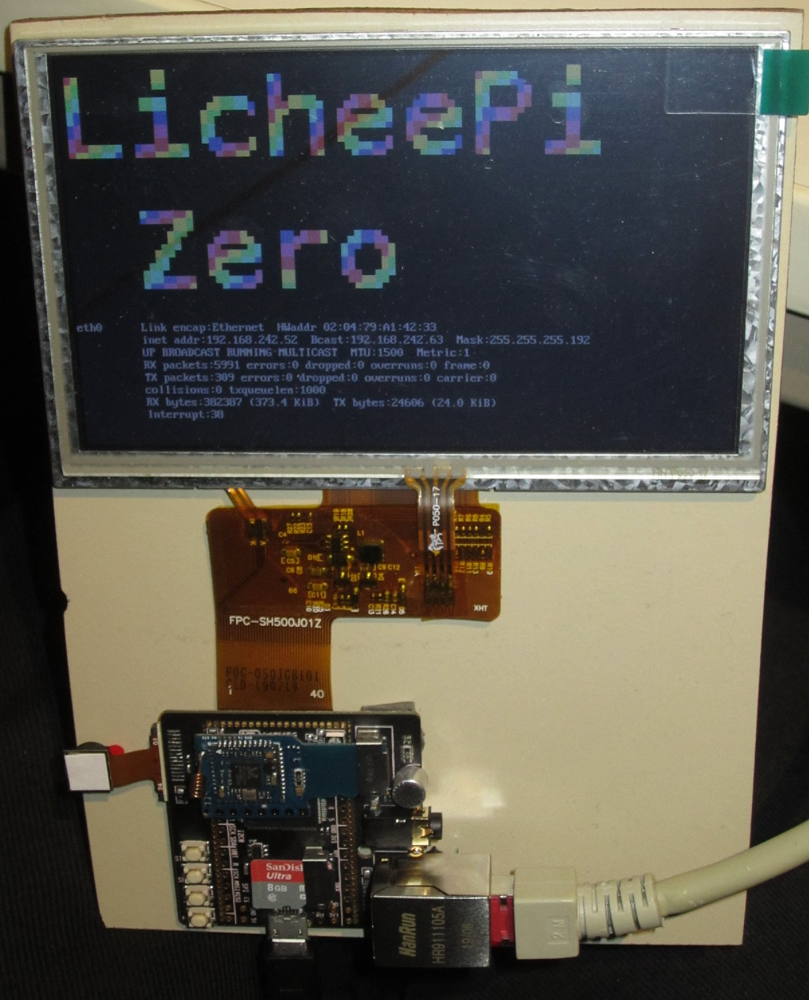

# buildroot-v3s #

An external layer for buildroot to get Allwinner V3s based systems (like the
LicheePi Zero) up and running. It is loosely based upon the
[work of squonk42](https://github.com/Squonk42/buildroot-licheepi-zero).

This is an additional layer, based upon the information of the
[buildroot user manual](https://buildroot.org/downloads/manual/manual.html)
about keeping customizations outside of buildroot.

A script `setup.sh` is added to simplify the usage of the additional layer
by also including the download, unpacking and configuration of a vanilla
buildroot release.

# Hardware #

I bought my hardware here:
* [without dock](https://www.banggood.com/Lichee-Pi-Zero-1_2GHz-Cortex-A7-512Mbit-DDR-Core-Board-Development-Board-Mini-PC-p-1351124.html)
* [with dock](https://www.banggood.com/LicheePi-Zero-1GHz-Cortex-A7-512Mbit-DDR-Development-Board-Mini-PC-p-1337966.html)
* [800x480 LCD](https://www.banggood.com/Lichee-Pi-5-inch-LCD-Display-RTP-800480-Resolution-With-4-wire-Resistive-Touch-Screen-p-1340806.html)
* [bundle (including wifi)](http://www.aliexpress.com/item/4000079405909.html)

# Configurations for v3s layer #

A try to get a configuration for a Lichee Pi Zero board adapeted just using
mainline components. The configs are split up into different variants,
including the dock and a 800x480 LCD.

| Defconfig                               | Status                           |
| --------------------------------------- | -------------------------------- |
| licheepi_zero_dock_lcd_defconfig        | working                          |
| licheepi_zero_defconfig                 | untested                         |
| licheepi_zero_dock_defconfig            | working as squonk42 layer        |
| licheepi_zero_lcd800x480_defconfig      | untested                         |
| licheepi_zero_dock_lcd800x480_defconfig | not booting due to broken dtb    |

## Versions ##

| Component | Version     | Comment                                          |
| --------- | ----------- | ------------------------------------------------ |
| Buildroot | 2019.11.1   | (upgraded asap to 2020.02 LTS)                   |
| Linux     | zero-4.14.y | fork: https://github.com/Lichee-Pi/linux         |
| U-Boot    | v3s-current | fork: https://github.com/Lichee-Pi/u-boot        |

Later on a port to mainline kernel and U-Boot is planned.

## Supported Hardware Status ##

| Hardware Feature | Status                                                  |
| -----------------| ------------------------------------------------------- |
| USB gadget       | working: serial (ttyGS0) + ethernet (usb0)              |
| ethernet         | working                                                 |
| MMC0             | working                                                 |
| MMC1             | working, tested with microSD and SDIO-wifi              |
| MMC2             | not tested (same pins as SPI0)                          |
| UART0            | working                                                 |
| UART1            | does not seem to be available                           |
| UART2            | does not seem to be available                           |
| SPI0             | untested, should be available                           |
| I2C0             | working (used by LCD touchscreen controller)            |
| I2C1             | does not seem to be available                           |
| LRDAC 4 buttons  | working, show effect in /dev/input/event0               |
| audio playback   | working                                                 |
| audio recording  | audio device available, not tested                      |
| LCD (800x480)    | working                                                 |
| camera           | not configured                                          |
| additional wifi  | working with external rtl8723bs driver for sdio         |
| bluetooth        | rtl8723bs has bluetooth, but no driver available        |

## Image ##

